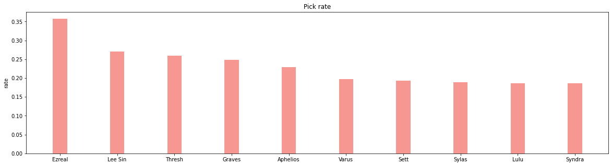
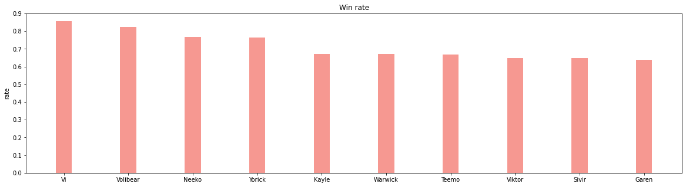
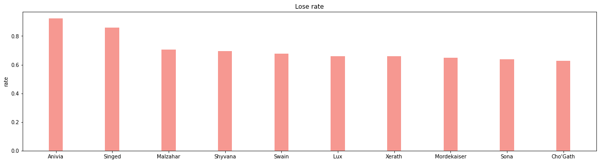
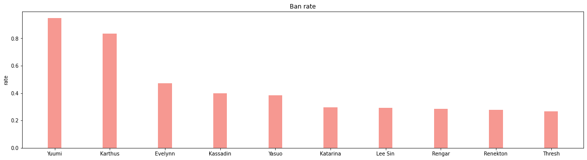
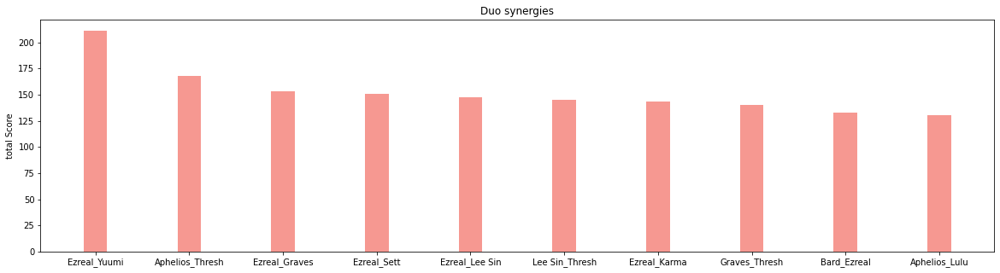

# League-of-legends Insights
In this mega-mini-project, we use League-of-Legends matches dataset to extract insight about games, champions, and items. Also, We use spark streaming given the Riot API to predict which team will win in a current on-going match, and threat of an opponent.

## Champions win - lose - pick - ban rates
Over 3000 matches we computed the normalized overall win, lose, pick and ban rates of each champion

Here are the top 10 champions in each category:
#### Pick 
The most picked is Ezreal

#### Win 
The most winning champion is Vi

#### Lose 
The most Losing champion is Anivia

#### Ban 
The most banned champion is Yuumi

## Champion Synergies or Duos
We tried to find the correlation between choosing a champion along side other champions of the same team.

By following a rigorous equation of finding the correlation and by giving higher weights to winning Duos, here are the top 10 duos over this season of LOL.

## Item Win - pick rates

## Item synergies (with champion, with class)

## Item suggestion
