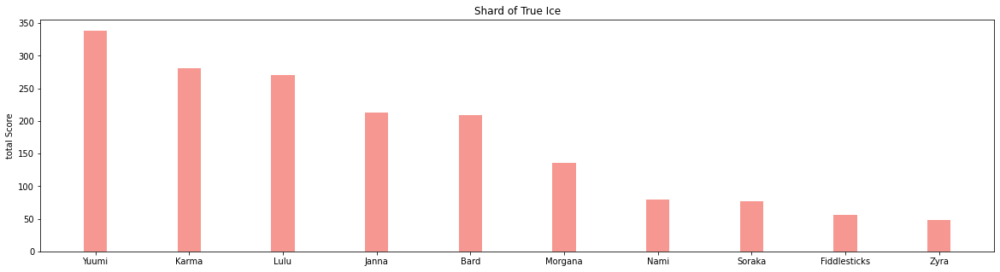

# League-of-legends Insights
In this mega-mini-project, we use League-of-Legends matches dataset to extract insight about games, champions, and items. Also, We use spark streaming given the Riot API to predict which team will win in a current on-going match, and threat of an opponent.

## Champions win - lose - pick - ban rates
Over 3000 matches we computed the normalized overall win, lose, pick and ban rates of each champion

Here are the top 10 champions in each category:
#### Pick 
The most picked is Ezreal

#### Win 
The most winning champion is Vi

#### Lose 
The most Losing champion is Anivia

#### Ban 
The most banned champion is Yuumi

## Champion Synergies or Duos
We tried to find the correlation between choosing a champion along side other champions of the same team.

By following a rigorous equation of finding the correlation and by giving higher weights to winning Duos, here are the top 10 duos over this season of LOL.

## Item  Pick-Win rates
We did the same as we did with Champions but this time with Items using the same complex function to compute win and Pick rates here is what we got:
#### Item Pick rate
The most picked item is **Hex core-mk2**

#### Item Win rate
The most picked item is also **Hex core-mk2**

## Item synergies (with champion, with class)
We did the same as we did with Champions but this time with Items using the same complex function to compute synergies of items along with both classes and Champions

We built a function that takes any Item and gives back the most compatible champions to use this item. Here is and example of **"Shard of True Ice"**

And same with classes here is another one with **"Faerie Charm"** Showing it works best with Support and Mage classes.

## Item suggestion
Now we come for Item suggestion. The main method followed here is that the higher the correlation between winning and obtaining the item the higher chance this item will be suggested for the player. We developed a function that takes any championId and gives back the most 6 winning item for that champion. Here are the results for **"Lulu"**

